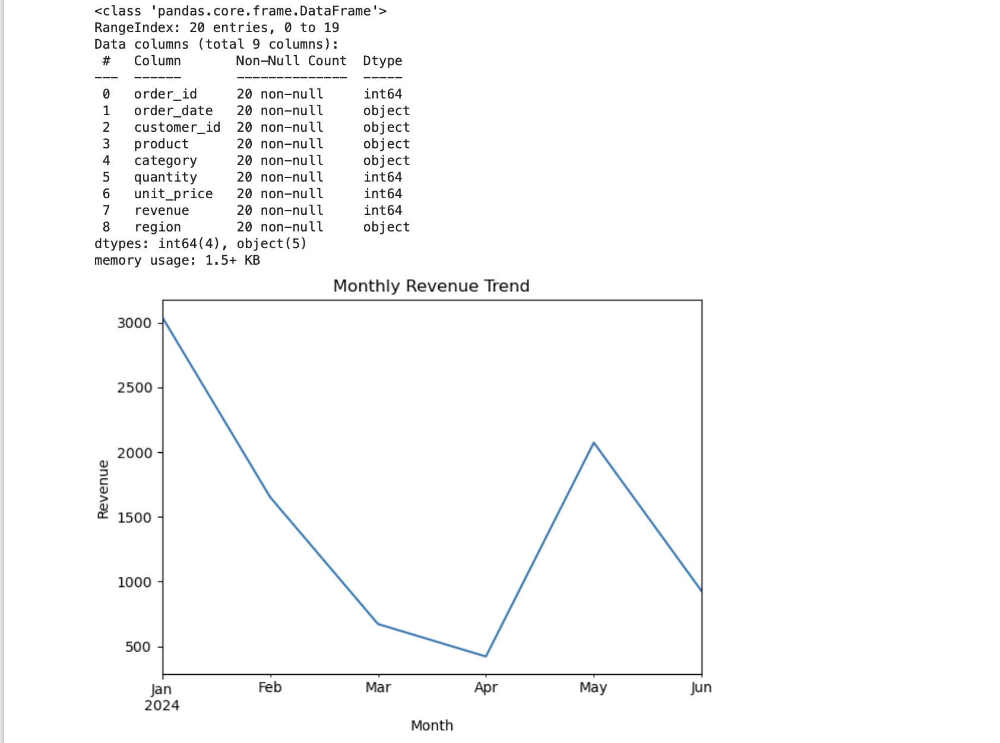

# Retail Sales Analysis – Python

## Business Objective
Analyze retail sales data to identify revenue trends, top-performing products, and seasonal patterns to support business decision-making.

## Dataset
The dataset contains transaction-level sales data including order date, product category, quantity sold, and revenue.

## Tools Used
- Python
- Pandas
- NumPy
- Matplotlib / Seaborn
- Jupyter Notebook

## Key Analysis Performed
- Data cleaning and preprocessing
- Revenue and quantity analysis by category
- Monthly sales trend analysis
- Visualization of top products and sales patterns

## Key Insights
- Electronics category generates the highest revenue.
- Sales peak during mid-year months, indicating seasonal demand.
- A small number of products contribute to a large portion of total revenue.

## Visualization Preview

### Category Performance

